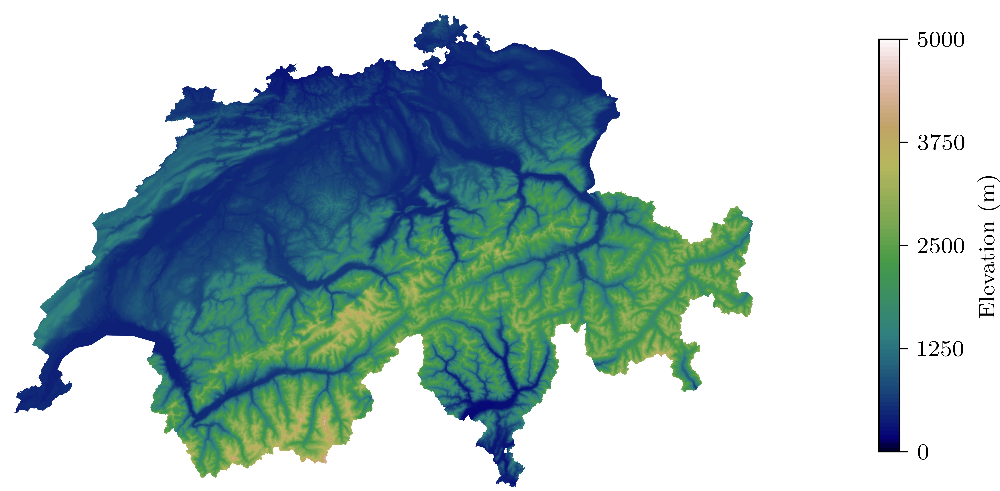

# Introduction

Switzerland is well known for it's mountains, covering roughly 70% of the country's total area. L'Office fédéral de topographie (swisstopo) has increadibly high-resolution elevation data (grid with spacing 25x25 meters) for the country. This can be used to generate beautiful elevation plots, like the one on the cover of this post.

#### Requirements

For this, you will need: 
* Python with `numpy`, `matplotlib`, `geopandas` and `shapely`

### Mapping the data

The data is freely available [here](https://data.geo.admin.ch/ch.swisstopo.digitales-hoehenmodell_25/data.zip) in it's rougher 200x200 m grid, which makes working with the data much easier. This data contains `x,y,z` coordinates of a mesh covering Switzerland and parts of the neighboring countries. The latitude (`x`) and longitude (`y`) are represented in the `MN03/LV03` coordinate system. This coordinate system is centered around the old observatory of Bern, nowadays the location of the Institute of Exact Sciences of Bern University, in downtown Bern (Sidlerstrasse 5 - 46°57'3.9" N, 7°26'19.1" E). We could just plot the data as is, but because we are going to use a `Geopandas` later on to plot the country's boundary, it is much more convenient to map the data into a more common space, the `EPSG-4216 - WGS84`. 

Conversion between well-known coordinate systems can be performed directly in `GeoPandas`, unfortunately, the Swiss coordinate system is not so common, which means we have to map the data "by hand". [Approximate formulas for the transformation between Swiss projection coordinates and WGS84](https://www.swisstopo.admin.ch/content/swisstopo-internet/en/topics/survey/reference-systems/switzerland/_jcr_content/contentPar/tabs/items/dokumente_publikatio/tabPar/downloadlist/downloadItems/516_1459343097192.download/ch1903wgs84-EN.pdf) can be found in the article referenced. These formulas take `x`, `y' coordinates and height (`z`) and map those onto longitude, latitudes, and elevation.

```python
def MN03_to_WGS84(x,y,height):
    """"
    transform MN03/LV03 into WGS84
    """
    x = (x - 200000)/1000000
    y = (y - 600000)/1000000
    lat = 16.9023892 + 3.238272 * x - 0.270978 * y**2 - 0.002528 * x**2 - 0.0447 * y**2 * x - 0.0140 * x**3 
    lon = 2.6779094 + 4.728982 * y  + 0.791484 * y*x + 0.1306 * y * x**2 - 0.0436 * y**3
    lat = lat * 100/36
    lon = lon * 100/36
    elev = elev + 49.55 - 12.60 * y - 22.64 * x
    return lat, lon, elev
```

Now that we have this, we can load the `.xyz` data obtained from `swisstopo`, extract the relevant information, and map it into the `WGS84` coordinate system.

```python
# read elevation data
xyz_data = np.genfromtxt("DHM200.xyz")

# extract xyz data, MN03 NF02 coordinate system
x = xyz_data[:,1]
y = xyz_data[:,0]
height = xyz_data[:,2]

# transform manually
lat, lon, height = MN03_to_WGS84(x,y,height)
```

We could plot the data like this, but it doesn't look very nice. We need to remove the parts of the data that fall outside of Switzerland.


**Figure 1**: Topographic data.


### Masking boundaries

To remove the elevation points that fall outside Switzerland, we can use the mask function of `GeoPandas` and use the Swiss boundary data to mask parts outside of the country. The shape files (`.shp`) that contain the polygon data can be found [here](https://data.geo.admin.ch/ch.swisstopo.swissboundaries3d/swissboundaries3d_2023-01/swissboundaries3d_2023-01_2056_5728.shp.zip). The data contains boundary data for Switzerland and part of the neighboring countries, we don't need those, and we can simply drop them (stored at index `1,2,3`). Then we need to map this data onto the `WGS84` projection.

```python
# Read file using gpd.read_file()
data = gpd.read_file("swissBOUNDARIES3D_1_3_TLM_LANDESGEBIET.shp")
data.drop([1,2,3], axis=0, inplace=True)
data = gpd.GeoSeries(data.geometry)
data = data.to_crs("EPSG:4326")
```

To mask the data, we will first create a `Polygon` that englobes the full dataset and the perform a boolean operation with the boundary data, such that only the parts outside Switzerland are masked.

```python
# generate mask for Switzerland
mask = gpd.GeoSeries(Polygon([(min(lon),min(lat)),
                              (min(lon),max(lat)),
                              (max(lon),max(lat)),
                              (max(lon),min(lat))]), crs="EPSG:4326")
mask = mask.difference(data) 
```

### Plotting the data

We can now finally plot the data; here I use `matplotlib` for that. The elevation data is plotted with the `tricontourf` function that first generates a Delauney triangulation of the data and then interpolates the elevation data onto this triangular mesh. The mask data is applied as a subsequent white layer on the exterior of Switzerland, effectively masking the data that overfills the plot. Here I have deliberately clipped the elevation data between 0 and 5000 meters.

```python
# plot contour
fig, ax = plt.subplots(1, 1, figsize=cm_(18,8))
cntr = ax.tricontourf(lon, lat, height, levels=np.linspace(0,5000,101), cmap="gist_earth")
fig.colorbar(cntr, ax=ax, shrink=0.84, ticks=np.linspace(0,5000,5), label="Elevation (m)")

# plot boundary
mask.plot(ax=ax, color="white")
plt.axis("off")
plt.show()
```


**Figure 2**: Topographic map of Switzerland.

The full script to load the data and generate the figure can be obtained below

* [script](../assets/scripts/figure.py)

### data link

* [Boundary of Switzerland](https://data.geo.admin.ch/ch.swisstopo.swissboundaries3d/swissboundaries3d_2023-01/swissboundaries3d_2023-01_2056_5728.shp.zip)

* [Elevation data](https://data.geo.admin.ch/ch.swisstopo.digitales-hoehenmodell_25/data.zip)